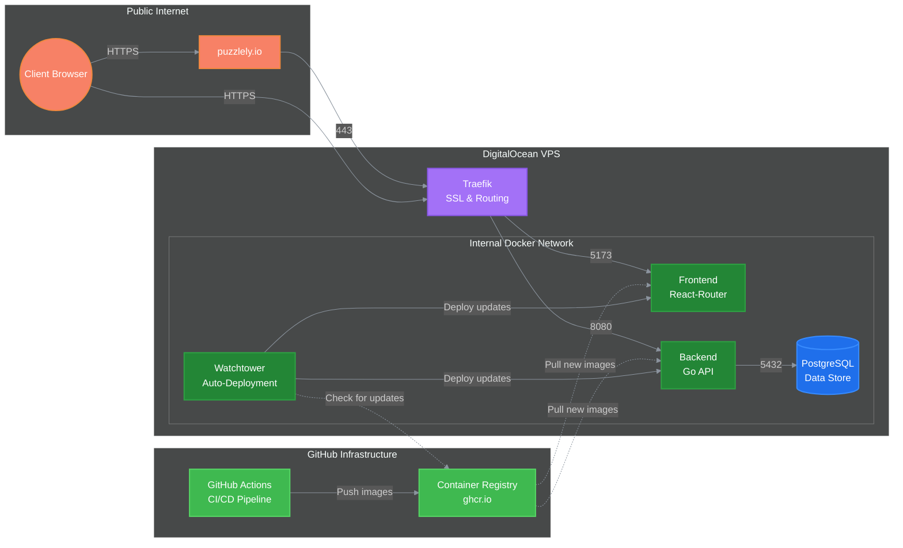

<a href="https://puzzlely.io?utm_source=Github&utm_medium=social">
 

  
  

</a>
<h3 align="center">
  <strong>What if Connections, but infinite? No more waiting until tomorrow, no more rationing your daily word-grouping fix. Just pure, unbridled classification chaos.</strong>
</h3>

---

## Tech Stack

### Frontend (web)

- Typescript
- React-Router/Remix
- React
- Zod
- Radix
- Motion
- TailwindCSS

### Backend (api)

- Go
- Postgres
- OpenTelemetry

## Folder Structure

|  Codebase  |         Description         |
| :--------: | :-------------------------: |
| [api](api) |        Go API Server        |
| [web](web) | React-Router/Remix frontend |

## Architecture

## Contributions

Puzzlely is open to contributions, but I recommend that you first create an issue or reply to a comment so we don't accidentally override each other.

Please read [CONTRIBUTING.md](CONTRIBUTING.md) for more details.
